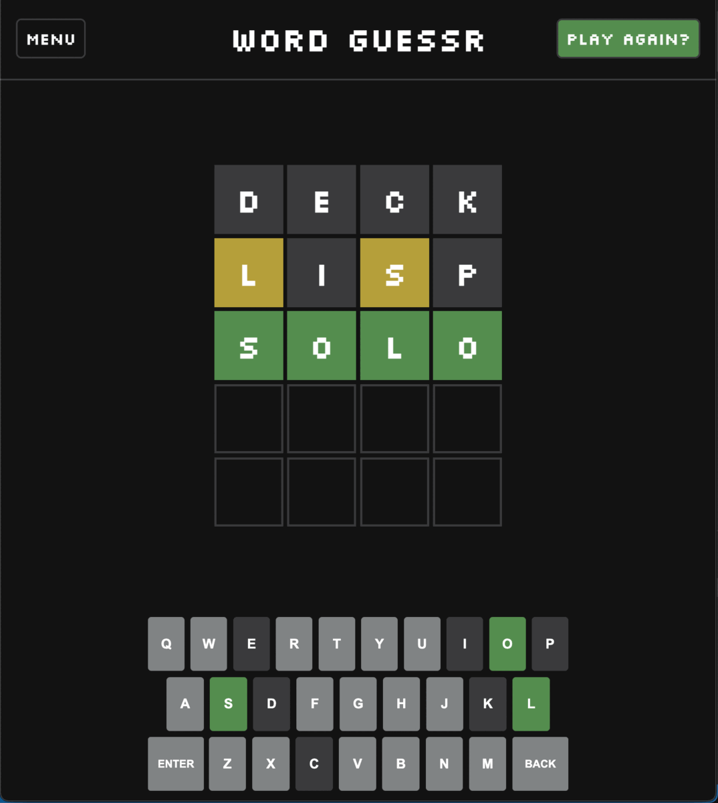
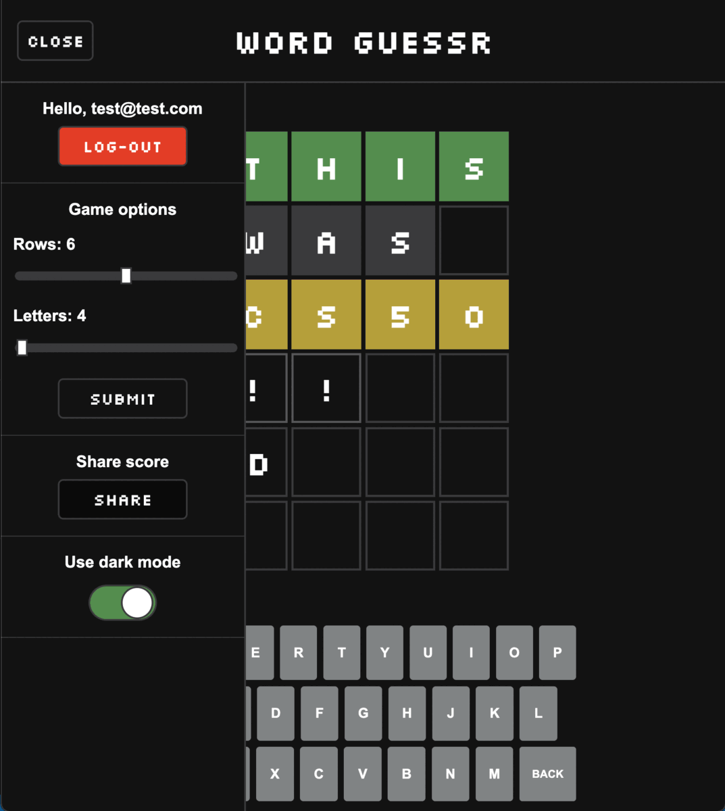
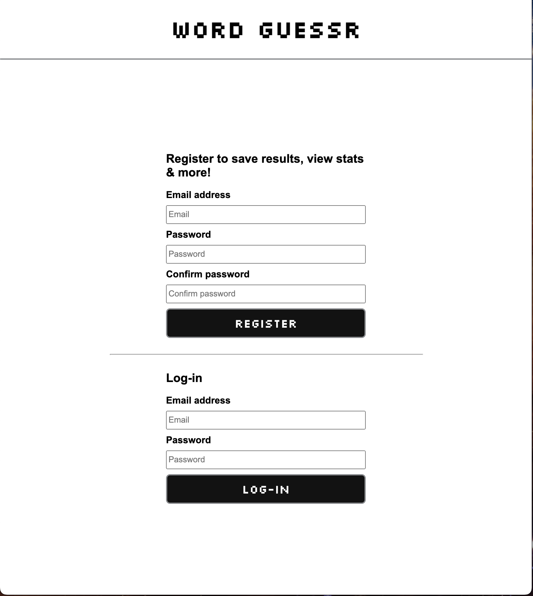
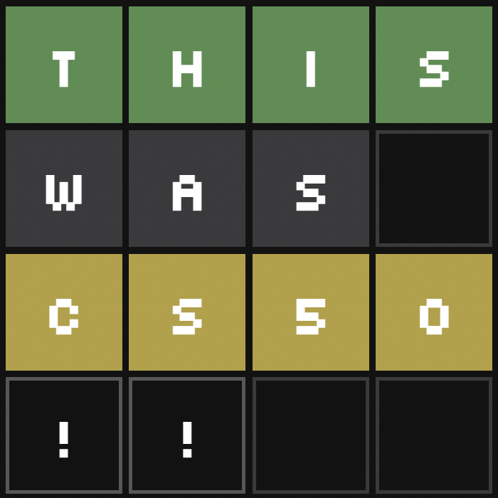

# Word Guessr (Wordle clone)

<p align="center">
  
</p>

It is web app developed with Javascript and Flask (Python) as back-end to test my fullstack abilities.

Based on a popular web app, the objective is to guess the word with a limited number of attempts. The user can change the parameters of # of letters and attempts.

**Video Demo:**  <PENDING>

## Table of contents

- [Tech Stack](#tech-stack)
- [Implemented Features](#implemented-features)
- [Getting Started](#getting-started)
- [Project Structure](#project-structure)
- [Main Takeaways](#main-takeaways)

## Tech Stack

- JavaScript
- Python
- Flask
- HTML
- CSS
- SQL database
- API calls

## Implemented Features

- Animations done manually in CSS
- Share score using emojis 🟩🥲🤩
- Dynamic board size based on settings:
  - Number of letters
  - Difficulty (number of attempts)

<p align="center">
  
</p>

- Theming support for Dark & Light modes (Default theme is light mode)

<p align="center">
  
</p>

- **Words API**
  - Get random words to play
  - Check if submitted word exists
  - Display definition at the end of game
- **User accounts**
  - Register & Log-in
  - Store them in a SQLite3 database
  - Encrypt passwords by salting them and using a hash (SHA-256)
  - Store statistics for each user

<p align="center">
  
</p>

- **Storage**
  - Retrieve stats from **LocalStorage** when not logged in
  - Retrieve stats from the **SQLite3 DB** when logged in
  - Store theme preference
  - Store submitted words
- **Statistics**
  - Games played
  - Win percentage
  - Current win streak
  - Max streak

<p align="center">
  
</p>

## Getting started

Follow these steps to set-up the project (detailed instructions are shown further down):

1. Clone this repository
2. Create a virtual environment and activate it by following the [installation guide](https://flask.palletsprojects.com/en/2.2.x/installation/) from Flask.
3. Run `pip install -r requirements.txt` to install [dependencies](#dependencies)
4. [Get Words API key](#signing-up-for-words-api)
5. [Generate Secret key](#secret-key)
6. [Create `.env` file](#environment-variables)
7. [Create SQLite3 db tables](#creating-the-database)
8. [Run the server](#running-the-server)
  
### Dependencies

`pip install flask`

- Needed for Python web server

`pip install python-dotenv`

- Needed for environment variables

`pip install requests`

- Needed for API calls

`pip install flask-sqlalchemy`

- Needed for SQL database

### Signing up for Words API

Go to [rapidapi.com](www.rapidapi.com), sign up and select the Basic plan for [Words API](https://rapidapi.com/dpventures/api/wordsapi/).

Be sure to copy the API key into the `.env` file.

### Secret Key

Furthermore, Flask needs a secret key to store session variables.
We can create one ourselves by entering the following commands into the python interpreter.

``` python
>>> import os
>>> print(os.urandom(24).hex())
```

And copy the random string into the `.env` file.

### Environment variables

We can use environment variables with `python-dotenv` and Flask to hide secrets such as API keys.
(See [this](https://flask.palletsprojects.com/en/2.2.x/cli/#environment-variables-from-dotenv) for help on how to use environment variables with flask)

Create a file named `.env` and add the following lines:

    RAPID_API_KEY = {KEY GOES HERE}
    SECRET_KEY = {KEY GOES HERE}

[Source](<https://medium.com/thedevproject/start-using-env-for-your-flask-project-and-stop-using-environment-variables-for-development-247dc12468be>)

### Creating the database

Type the following line in the .py file where the main Flask app is located.

``` python
app.config['SQLALCHEMY_DATABASE_URI'] = 'sqlite:///DB_NAME.sqlite3'
```

Notice the "///" (three forward slashes) as it is important to create the database file in the root directory of the project folder (relative path).

Follow the [quickstart guide](https://flask-sqlalchemy.palletsprojects.com/en/2.x/quickstart/) from the docs to create the table structure (schema) of the db:

``` python
# Import from app.py
from app import app
from flask_sqlalchemy import SQLAlchemy
db = SQLAlchemy(app)

class User(db.Model):
  ...
```

Then we run in the python terminal the following command to create the tables:

``` python
>>> from app import db
>>> db.create_all()
```

### Running the server

- Execute `flask run`
- Go to <http://127.0.0.1:5000/>
- Voilà !

## Project structure

The project has the following tree structure:

    .
    ├── README.md         (Readme file)
    ├── app.py            (Flask backend)
    ├── database.py       (Database configuration)
    ├── static
    │   ├── app.js        (Main javascript frontend code)
    │   ├── register.js   (Js file for register.html)
    │   ├── favicon.ico   (Website icon)
    │   └── style.css     (Styles sheet)
    ├── templates
    │   ├── register.html
    │   ├── layout.html   (Main HTML layout using Jinja templates)
    │   └── index.html    (Main website)

## Main takeaways

The main things I learned after developing this web app are:

- Javascript and Python
- HTML and CSS styling
- How Back-ends work using Flask
- Using LocalStorage with JS
- Sending data back and forth between the Front-end and Back-end
  - API and HTTP requests using RESTful commands
  - Use of JSON data formats
  - JS fetch requests (including async/await)

<p align="center">
  
</p>

Thank you!
